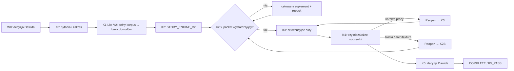
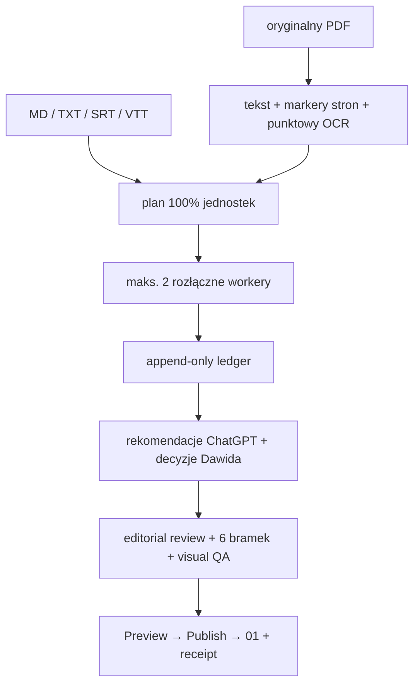
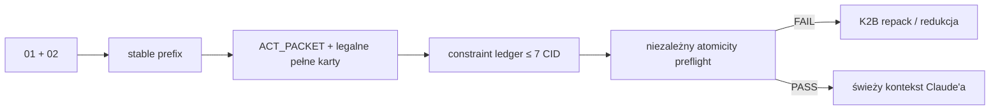
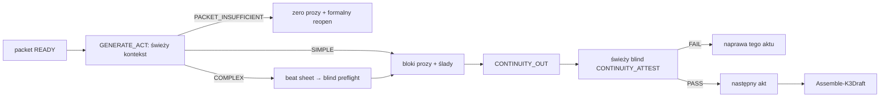
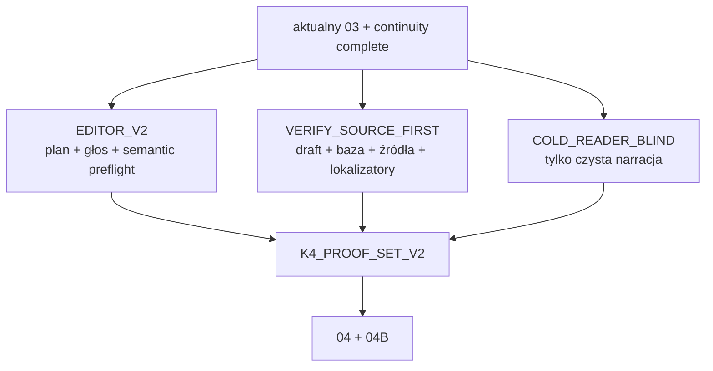

# MAPA SYSTEMU v7.0

Od 2026-09-12, na polecenie Dawida, jedyną wersją wybieraną dla nowych projektów jest `2026-08-31_NARRATIVE_V2`. `New-Project.ps1` wybiera ją domyślnie. Status jakości pozostaje `PILOT_ONLY`: uporządkowanie i wybór wersji nie są wynikiem testu A/B ani zatwierdzeniem profilu głosu. Istniejące projekty zachowują swój origin, rewizję, tekst i receipty; nie są automatycznie migrowane. Kod zgodności służy zachowaniu dostępu do tych projektów, nie stanowi drugiej instalacji systemu.

## K1: duże źródła bez przepalania kontekstu

Compile działa tylko w K1, a Merge tylko w K2B. Narzędzia odczytują etap ponownie pod blokadą, wiążą source snapshot i nie zostawiają rezultatu po odmowie. Źródła nie są pomijane; oszczędność bierze się z lokalnej konwersji, małych paczek i ponownego użycia wyników po hashach.

## K2 i packet

Story Engine opisuje Story DNA, stan wiedzy oraz nacisk emocjonalny widza, pytania NQ, reveale NR, kontakt VC, Scene Weave, funkcje REQUIRED/SUPPORTING/RESERVE i completion criteria. Nie używa budżetu słów ani znaków.

Pełna Biblia narracji jest zapleczem K2/K4. Autor K3 dostaje tylko skompilowany `K3-RULES-CORE`, voice profile, Story Spine, continuity i packet bieżącego aktu.

## Wnętrze K3

Następny akt nie może wyprzedzić PASS. OUT wiąże stan do exact `BLOCK_ID/BLOCK_SHA`, nie do zamiaru autora. Zmiana wcześniejszego aktu unieważnia zależną ciągłość. Powtórzenie ruchu otwarcia/zamknięcia daje alert, a świadomy wyjątek wymaga decyzji Dawida.

## K4: opowieść, prawda i doświadczenie

Każda soczewka ma inny `RUN_ID`, `TASK_ID` i świeży kontekst. Semantic preflight wykrywa m.in. skopiowaną frazę exemplarów i nieplanowany kontakt, a zakazany humor jest twardym FAIL. Verify blokuje zawyżoną pewność. Cold Reader nie zna planu. Po zmianie draftu soczewka ma świeży run albo ważny carry-forward oparty na aktualnym dependency fingerprint; zmiana semantic preflight wymusza ponowną ocenę Editora.

## Długość i finał

`GUIDE` informuje po napisaniu. `HARD_MAX` ogranicza finalną całość. Żaden tryb nie tworzy dolnego progu ani targetu per akt. K5 wiąże czystą narrację, proof set, continuity i wynik pomiaru; akceptację daje tylko Dawid.

## Stan mechaniczny

`Advance-Stage.ps1` bez `-Apply` pokazuje ruch, a z `-Apply` wykonuje go po PASS. `Reopen-Stage.ps1` jest jedynym powrotem Narrative V2. Origin, project lock, pełny manifest, CAS, journal i rollback chronią stan. Ręczna zmiana `meta.md` nie zastępuje mutatora ani receiptu.

Gałąź legacy zachowuje stare narzędzia i schematy tylko dla zgodności. `_work/k3-pakiety/`, budżet aktu i `K3_BUDGET_OVERRIDE` są niedozwolone w Narrative V2.
